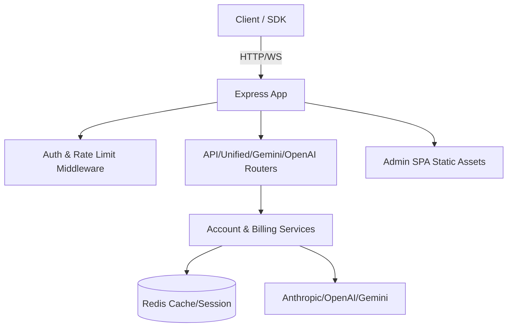

# 架构设计

## 总体架构

## 技术栈
- **后端:** Node.js 18、Express、Redis
- **前端:** Vue 3、Vite、Element Plus（路径 `/admin-next` 构建输出）
- **工具:** ESLint、Prettier、Docker、docker-compose

## 核心流程
- 统一路由：`/api`、`/openai`、`/gemini` 等入口经鉴权与限流后调度到对应上游账户。
- 统计收集：调用记录写入 Redis 列表，用于时间线与费用计算。
- 管理端：Express 提供静态 SPA；管理员接口前缀 `/admin`，本次新增 `/admin/usage-records-timeline` 聚合调用明细。

## 重大架构决策
| adr_id | title | date | status | affected_modules | details |
|--------|-------|------|--------|------------------|---------|
| ADR-001 | 多路由分层与聚合统计 | 2025-12-09 | ✅已采纳 | admin 路由、统计服务 | history/2025-12/202512091750_usage-timeline/how.md#架构决策-adr |
