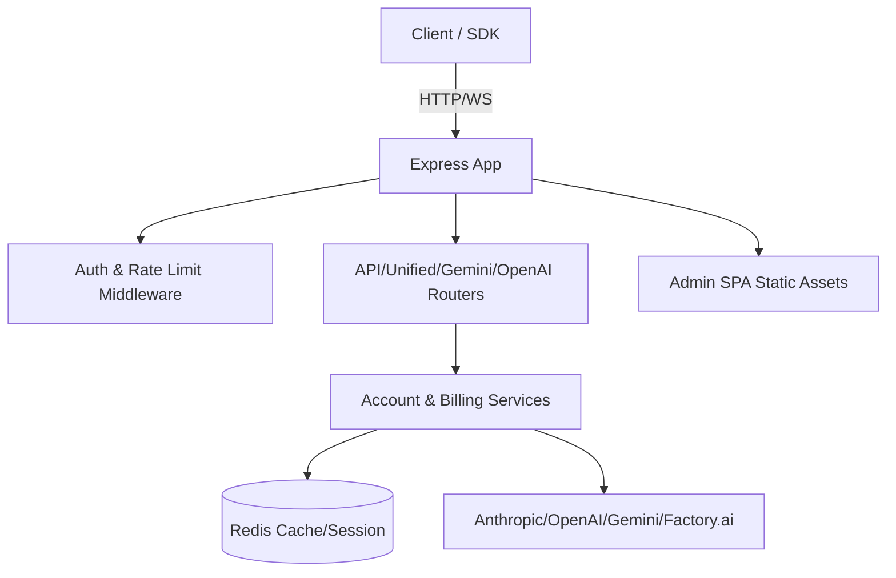

# 架构设计

## 总体架构

## 技术栈
- 后端：Node.js 18+、Express、Redis
- 工具：ESLint、Prettier、Jest、Docker、docker-compose
- 前端：`web/admin-spa`（构建后静态文件由 Express 提供）

## 核心流程
- 统一路由：`/api`、`/openai`、`/gemini` 等路径归一到统一调度逻辑
- 安全与限流：全局速率限制、请求大小限制、Helmet/CORS、中间件日志
- 健康监控：`/health`、`/metrics` 返回运行状态与资源使用

## 重大架构决策
完整的 ADR 存储在各变更的 `how.md` 中，本章节提供索引。

| adr_id | title | date | status | affected_modules | details |
|--------|-------|------|--------|------------------|---------|
| - | 暂无 | - | - | - | - |
